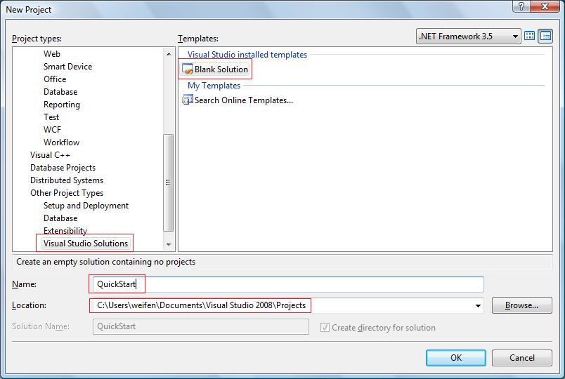

# QuickStart Sample

## Create an empty QuickStart Solution in Visual Studio 2008

Open `Visual Studio 2008`, select menu `File` -> `New` -> `Project...`:



In left side `Project types`, select `Other Project Types` -> `Visual Studio Solutions`, then select `Blank Solution` in Templates. Enter `QuickStart` as Name:

Click `OK` button, an empty solution named `QuickStart` created.

## Create a new .snk key pair file

1. Open Visual Studio 2008 Command Prompt from the start menu: `Microsoft Visual Studio 2008` -> `Visual Studio Tools`.
2. Change the current directory to the directory where the empty solution was created.
3. Enter the following command to generate a new .snk file:
    ```powershell
    sn -k key.snk
    ```
4. Verify a new file named `key.snk` created in the directory where the empty solution was created.

## Next Steps

- @sample_publisher
- @sample_app
- @run_quickstart_sample