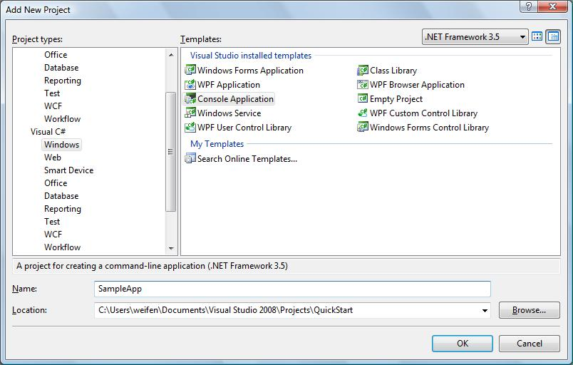
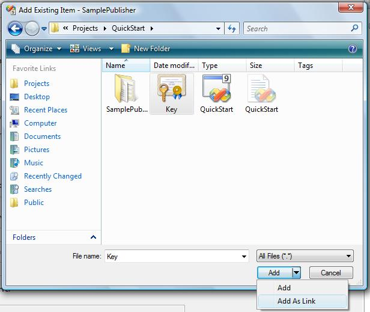
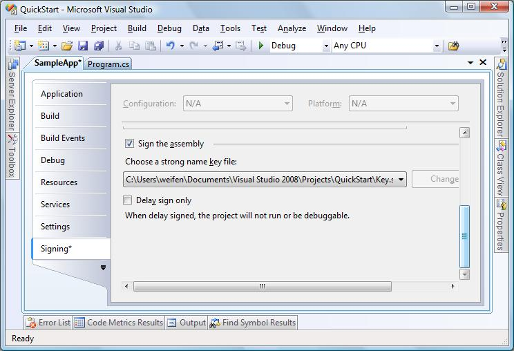
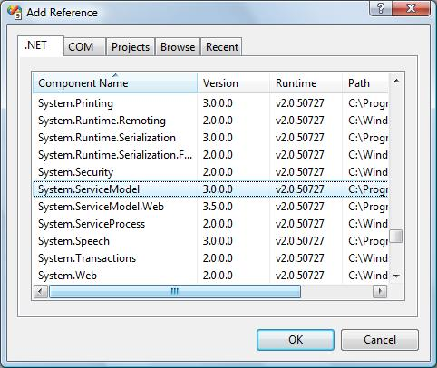
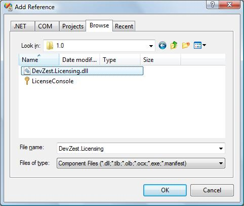
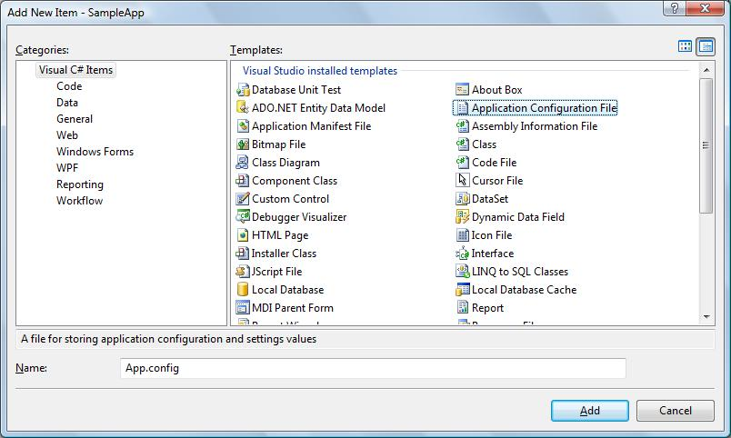

# SampleApp

This walk-through creates the `SampleApp`, the console application consumes the license.

## Create SampleApp Project

In `Solution Explorer`, right click the `QuickStart` solution, select `Add -> New Project...`:



In left side `Project types`, select `Visual C#` -> `Windows`, then select `Console Application` in `Templates`. Enter `SampleApp` as `Name`.

A `SampleApp` console application project created.

Right click the created `SampleApp` project in `Solution Explorer`, select `Add` -> `Existing Item`:



Navigate to the file `key.snk` previously created, click the drop down arrow of button `Add`, then click `Add as Link`.

Right click `SampleApp` project in `Solution Explorer`, select `Properties`:



In `Signing` tab, Check `Sign the assembly`, select the previously added `key.snk` file from `Choose a strong name key file`.

## Add Reference to System.ServiceModel assembly and DevZest.Licensing.dll assembly

In `Solution Explorer`, right click `SampleApp` project, select `References...`

Under .NET tab:



Browse to assembly `System.ServiceModel`, and click button `OK`.

Under `Browse` tab:



Browse to file `DevZest.Licensing.dll` and click button `OK`. This file is installed in the `C:\Program Files\DevZest\.Net Licensing\1.0` folder by default.

## Add Testing Code

Enter code in file `Program.cs`:

```csharp
using System;
using System.IO;
using System.Reflection;
using System.ServiceModel;
using DevZest.Licensing;

[assembly: FileLicenseProvider]

namespace SampleApp
{
    static class Program
    {
        // The AssemblyProduct attribute of SampleApp
        private const string Product = "SampleApp";

        // The license item names
        private static class LicenseItems
        {
            public const string Feature1 = "Feature1";
            public const string Feature2 = "Feature2";
        }

        private enum LicenseCategory
        {
            ExpiredEvaluation = 0,
            Evaluation,
            Registered
        }

        private static LicenseKey[] s_licenseKeys = {
            new LicenseKey("6VL8P-QHCRS-PF2GJ-8XLYG-VKHH4"),
            new LicenseKey("ZSWPT-Q3QV8-V9MM9-4WVFA-9Z9CQ"),
            new LicenseKey("XYDSY-LSKC5-9XVSJ-3QYLT-MALBQ") };

        static void Main(string[] args)
        {
            Output();
            for (int input = Input(); input != 0; input = Input())
            {
                GetLicense((LicenseCategory)(input - 1));
                Output();
            }
        }

        private static void GetLicense(LicenseCategory licenseCategory)
        {
            LicenseClient licenseClient = new LicenseClient(LicenseClient.PublicKeyXmlFromAssembly(Assembly.GetExecutingAssembly()));
            try
            {
                LicensePublisherResponse response = licenseClient.GetLicense(
                    Product,
                    Assembly.GetExecutingAssembly().GetName().Version,
                    s_licenseKeys[(int)licenseCategory],
                    licenseCategory.ToString(),
                    "Test User",
                    "Test Company",
                    "testuser@test.com",
                    MachineLicense.LocalMachineData);
                License license = response.License;
                if (license == null)
                    Console.WriteLine("ERROR: " + response.ErrorMessage);
                else
                {
                    File.WriteAllText(Assembly.GetExecutingAssembly().Location + ".lic", license.SignedString);
                    LicenseManager.Reset();
                }

                licenseClient.Close();
            }
            catch (CommunicationException exception)
            {
                Console.WriteLine("EXCEPTION: " + exception.Message);
                licenseClient.Abort();
            }
        }

        private static int Input()
        {
            string[] categories = Enum.GetNames(typeof(LicenseCategory));
            for (int i = 0; i < categories.Length; i++)
                Console.WriteLine(string.Format("{0}: {1} ({2})", i + 1, categories[i], s_licenseKeys[i]));

            Console.WriteLine("0: Exit");
            while (true)
            {
                Console.Write("Please Enter: ");
                string input = Console.ReadLine();
                try
                {
                    int returnValue = Convert.ToInt32(input);
                    if (returnValue >= 0 && returnValue <= categories.Length)
                        return returnValue;
                }
                catch (FormatException)
                {
                }
            }
        }

        private static void Output()
        {
            Console.WriteLine();
            License license = LicenseManager.GetLicense();
            if (license == null)
                Console.WriteLine("This application is not licensed");
            else
            {
                Console.WriteLine("License of this application:");
                Console.WriteLine(license.SignedString);
                OutputLicenseItemValidation(LicenseItems.Feature1);
                OutputLicenseItemValidation(LicenseItems.Feature2);
            }

            Console.WriteLine();
        }

        private static void OutputLicenseItemValidation(string licenseItemName)
        {
            LicenseError licenseError = LicenseManager.Check(licenseItemName);
            Console.Write(licenseItemName + ": ");
            if (licenseError == null)
                Console.WriteLine("A valid license granted");
            else
                Console.WriteLine(string.Format("Cannot grant a valid license, reason=\"{0}\", message=\"{1}\"", licenseError.Reason, licenseError.Message));
        }
    }
}
```

## Configure the Application

In `Solution Explorer`, right click `SampleApp` project, select `Add New Item...`:



In left side `Categories`, select `Visual C# Items`, then select `Application Configuration File` in `Templates`. Don't change the default name `App.config`.

Enter the following XML in file `App.config`:

```xml
<?xml version="1.0" encoding="utf-8" ?>
<configuration>
  <!--
  <system.serviceModel>
    <bindings>
      <customBinding>
        <binding name="LicensePublisherSoap12">
          <textMessageEncoding messageVersion="Soap12" writeEncoding="utf-8" />
          <httpTransport />
        </binding>
      </customBinding>
    </bindings>
    <client>
      <endpoint
        address="http://localhost:16885/AsmxPublisher.asmx"
        binding="customBinding" bindingConfiguration="LicensePublisherSoap12"
        contract="DevZest.Licensing.ILicensePublisher" />      
    </client>
  </system.serviceModel>
  -->

  <system.serviceModel>
    <client>
      <endpoint
        address="http://localhost:16885/SvcPublisher.svc"
        binding="wsHttpBinding"
        contract="DevZest.Licensing.ILicensePublisher" />
    </client>
  </system.serviceModel>
</configuration>
```