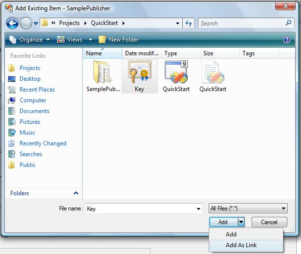

# SamplePublisher

This walk-through creates the `SamplePublisher`, the web service which publishes the license.

## Create SamplePublisher Project

In `Solution Explorer`, right click the `QuickStart` solution, select `Add` -> `New Project...`:


In left side `Project types`, select `Visual C#` -> `Web`, then select `ASP .Net Web Application` in Templates. Enter `SamplePublisher` as Name.

A `SamplePublisher` ASP .Net web project created.

Right click the created `SamplePublisher` project in `Solution Explorer`, select `Add` -> `Existing Item`:



Navigate to the file `key.snk` previously created, click the drop down arrow of button `Add`, then click `Add as Link`.

Right click `key.snk` in `SamplePublisher` project, select `Properties`:


set the `Build Action` as `Embedded Resource`.

Right click `SamplePublisher` project in `Solution Explorer`, select `Properties`.

In `Signing` tab:


Check `Sign the assembly`, select the previously added `key.snk` file from `Choose a strong name key file`.

In `Web` tab:


Enter port number `16885` under `Servers` -> `Use Visual Stuido Development Server` -> `Specific port`. This port number will be used in `SampleApp` configuration file.

## Add reference to WindowsBase assembly and DevZest.Licensing.dll assembly

In `Solution Explorer`, right click `SamplePublisher` project, select `References...`

Under `.NET` tab:


Browse to assembly `WindowsBase`, and click button `OK`.

Under `Browse` tab:


Browse to file `DevZest.Licensing.dll` and click button `OK`. This file is installed in the `C:\Program Files\DevZest\.Net Licensing\1.0` folder by default.

## Add new class Publisher.vb to the project

In `Solution Explorer`, right click `SamplePublisher` project, select `Add New Item...`:


In left side `Categories`, select `Visual Basic` -> `Code`, then select `Class` in `Templates`. Enter `Publisher.vb` as `Name`.

Enter code in file `Publisher.vb`:

```vb
Imports System
Imports System.Diagnostics
Imports System.Collections.Generic
Imports DevZest.Licensing
Imports System.IO
Imports System.Web.Services
Imports System.Reflection
Imports System.Globalization


<WebService(Namespace:="http://services.devzest.com/Licensing")> _
Public Class Publisher
    Inherits LicensePublisher

    'The AssemblyProduct attribute of SampleApp
    Private Const Product As String = "SampleApp"

    'The license item names
    Private NotInheritable Class LicenseItems
        Public Const Feature1 As String = "Feature1"
        Public Const Feature2 As String = "Feature2"
    End Class

    Private Enum LicenseCategory
        ExpiredEvaluation = 0
        Evaluation
        Registered
    End Enum


    Private Shared s_licenseKeys As LicenseKey() = { _
        New LicenseKey("6VL8P-QHCRS-PF2GJ-8XLYG-VKHH4"), _
        New LicenseKey("ZSWPT-Q3QV8-V9MM9-4WVFA-9Z9CQ"), _
        New LicenseKey("XYDSY-LSKC5-9XVSJ-3QYLT-MALBQ")}

    Protected Overrides Function GetPrivateKeyXml(ByVal product As String) As String
        ' Load the private key file from current assembly's embedded resource.
        ' Note the resource name is namespace + file name, and it's CASE SENSITIVE.
        ' If wrong resource name provided, PrivateKeyXmlFromSnkFile throws ArgumentNullException!    
        Using stream As Stream = Assembly.GetExecutingAssembly().GetManifestResourceStream("SamplePublisher.Key.snk")
            Return PrivateKeyXmlFromSnkFile(stream)
        End Using
    End Function

    Protected Overrides Function GetLicense(ByVal cultureInfo As CultureInfo, ByVal product As String, ByVal version As Version, ByVal licenseKey As LicenseKey, ByVal category As String, ByVal userName As String, ByVal company As String, ByVal emailAddress As String, ByVal data As String) As LicensePublisherResponse
        'Check the product
        If product <> Publisher.Product Then
            Return New LicensePublisherResponse("Invalid product!")
        End If

        'Check the license key and category
        Dim licenseCategory As Nullable(Of LicenseCategory) = Nothing
        For i As Integer = 0 To s_licenseKeys.Length - 1
            If s_licenseKeys(i) = licenseKey Then
                licenseCategory = CType(i, LicenseCategory)
                Exit For
            End If
        Next

        If Not licenseCategory.HasValue Then
            Return New LicensePublisherResponse("Invalid license key!")
        End If
        If licenseCategory.ToString() <> category Then
            Return New LicensePublisherResponse("Invalid category!")
        End If

        Dim license As License = New MachineLicense()
        license.Product = product
        license.Category = category
        license.UserName = userName
        license.Company = company
        license.Data = data
        license.Items.Add(New LicenseItem(LicenseItems.Feature1, True))  'Feature1's OverrideExpirationDate is true
        license.Items.Add(New LicenseItem(LicenseItems.Feature2))

        If licenseCategory = Publisher.LicenseCategory.Evaluation Then
            license.SetExpirationDate(DateTime.UtcNow.AddMonths(3))
        ElseIf licenseCategory = Publisher.LicenseCategory.ExpiredEvaluation Then
            license.SetExpirationDate(DateTime.UtcNow) 'Set ExpirationDate to now always expires the license
        End If

        Return New LicensePublisherResponse(license)
    End Function

End Class
```

## Add AsmxPublisher.asmx to the project

In `Solution Explorer`, right click `SamplePublisher` project, select `Add New Item...`:


In left side `Categories`, select `Visual Basic` -> `Web`, then select `Web Service` in `Templates`. Enter `AsmxPublisher.asmx` as `Name`.

Enter code in file `AsmxPublisher.asmx.vb`:

```vb
Imports System.Web.Services

<WebService(Namespace:="http://services.devzest.com/Licensing")> _
Public Class AsmxPublisher
    Inherits Publisher

End Class
```

## Add SvcPublisher.svc to the project

In `Solution Explorer`, right click `SamplePublisher` project, select `Add New Item...`:


In left side `Categories`, select `Visual Basic`, then select `WCF Service` in `Templates`. Enter `SvcPublisher.svc` as `Name`.

Delete the auto generated file `ISvcPublisher.vb` by right clicking this file in `Solution Explorer`, then select `Delete` from the context menu.

Enter code in `SvcPublisher.svc.vb`:

```vb
Public Class SvcPublisher
    Inherits Publisher

End Class
```

Update `Web.config`:

```xml
<system.serviceModel>
 <behaviors>
  <serviceBehaviors>
   <behavior name="SamplePublisher.SvcPublisherBehavior">
    <serviceMetadata httpGetEnabled="true" />
    <serviceDebug includeExceptionDetailInFaults="false" />
   </behavior>
  </serviceBehaviors>
 </behaviors>
 <services>
  <service behaviorConfiguration="SamplePublisher.SvcPublisherBehavior" name="SamplePublisher.SvcPublisher">
   <endpoint binding="wsHttpBinding" contract="DevZest.Licensing.ILicensePublisher" />
   <endpoint address="mex" binding="mexHttpBinding" contract="IMetadataExchange" />
  </service>
 </services>
</system.serviceModel>
```