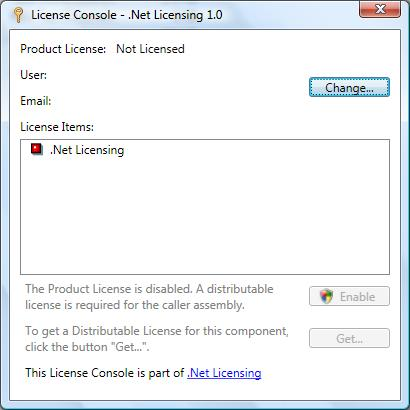

# Welcome to DevZest .Net Licensing

.Net Licensing is a lightweight yet comprehensive licensing solution for Microsoft .Net platform. This solution, provided as a .Net component, provides the same level security as signing your .Net assembly, and gives you utmost control and flexibility.

## Summary

### Everything is under your control

All licenses are published through your own web service. You have full control on when and how a license should be published: with or without a license key, valid for certain period, or upgradable with future versions within certain period, etc; A license can contain multiple license items (features) you can grant or revoke accordingly; You can even disable a refunded license key for future use. Everything is under your control.

### Same level security as signing your .Net assembly

Each license is digitally signed and verified with the same strong name key used to sign your protected .Net assembly. Only your own license publisher web service can access the private key. This provides the same level security as signing your .Net assembly. Unless your private key is compromised, the verified license can always to trusted.

Using the same assembly strong name key also reduces the number of keys to manage and improves security.

### Simple and unified API to protect your .Net applications and components

We provide simple and unified API to protected your .Net applications and components. After you make the decision where to store the published license (registry, file/isolated storage file, or embedded resource in caller assembly), you can simply declare corresponding assembly level license provider attribute, and call LicenseManager.Validate in your code. This simple, unified API works for all your .Net applications and components, cross all .Net based technologies such as Windows Forms, ASP.Net and WPF.

### Least constraints: partial trust and no SSL required

The rewards of building applications that run under partial trust are great. The .Net Licensing component can run under medium trust level without any problem. That means you can deploy your license publisher in a shared hosting environment, and the protected applications and components can also run under partial trust.

Transparent to developer, the communication between your license client and license publisher is encrypted so that no SSL is required for the web server hosting the license publisher.

Altogether, this can save your cost directly.

### Fully customizable

The .Net Licensing component is fully extensible from all aspects: the license publisher, the license and license items, and the license provider to look up the license. The default implementation can meet most requirements, however you still have the freedom to extend this component easily.

## Screenshots

The product is not licensed:

Change the product license:

An Evaluation License obtained:

A Paid License obtained:

## How to Use

- Create a project in Visual Studio or other IDE, targeting .Net Framework 3.0 or later;
- Add nuget package [DevZest.Licensing](https://www.nuget.org/packages/DevZest.Licensing/) to your project.
- Documentation available: [Programming Guide](xref:getting_started) and [Class Reference](xref:DevZest.Licensing)
- Source code available: [https://github.com/DevZest/Licensing](https://github.com/DevZest/Licensing).
- Samples available: [https://github.com/DevZest/Licensing.Samples](https://github.com/DevZest/Licensing.Samples).